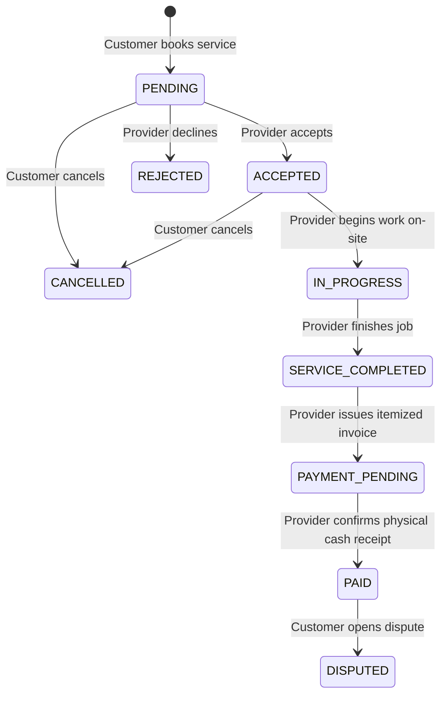

# Servora API Documentation

Welcome to the **Servora REST API Specification**. All endpoints conform to a standardized JSON response format:

```json
{
  "success": true,
  "statusCode": 200,
  "message": "Operation successful",
  "data": { ... }
}
```

---

## Base URL
```
http://localhost:5000/api
```

---

## Authentication & Authorization
All authenticated routes require a JWT Bearer token in the `Authorization` header:
```http
Authorization: Bearer <JWT_ACCESS_TOKEN>
```

### Roles Supported:
- `CUSTOMER`: Can browse marketplace, book services, pay invoices via Cash on Delivery, leave reviews, and chat with providers.
- `PROVIDER`: Can manage service listings, accept/start/complete bookings, issue itemized invoices, confirm cash payment receipt, and chat with customers.
- `ADMIN`: Full oversight over users, categories, services, bookings, payment confirmation/refunds, and audit activity logs.

---

## 1. Authentication Endpoints

### `POST /auth/register`
Create a new user account.
- **Request Body:**
  ```json
  {
    "name": "Usman Tariq",
    "email": "usman.customer@servora.com",
    "password": "Password123!",
    "role": "CUSTOMER", // or "PROVIDER"
    "phone": "+923001234567",
    "address": { "city": "Lahore", "street": "Main Boulevard" },
    // Provider only:
    "bio": "Certified electrical & HVAC specialist",
    "experienceYears": 8,
    "serviceAreas": ["DHA", "Gulberg", "Model Town"]
  }
  ```
- **Response `201 Created`:**
  Returns user object and JWT bearer token.

### `POST /auth/login`
Authenticate existing user.
- **Request Body:**
  ```json
  {
    "email": "usman.customer@servora.com",
    "password": "Password123!"
  }
  ```
- **Response `200 OK`:** Returns `{ user, token }`.

---

## 2. Categories

### `GET /categories`
Get all active categories grouped by domain (Home Services, Automotive, Technology, etc.). Cached in Redis for 1 hour.

### `POST /categories` *(Admin only)*
Create a new category.

---

## 3. Services Marketplace

### `GET /services`
Query parameters:
- `search`: Keyword search matching name and description
- `category`: Category ID or slug
- `minRating`: Minimum rating filter (e.g. `4.5`)
- `minPrice` / `maxPrice`: Price range filter on `startingPrice`
- `sortBy`: `startingPrice`, `rating`, `createdAt`
- `sortOrder`: `asc` or `desc`
- `page`: Default `1`
- `limit`: Default `12`

### `GET /services/:id`
Get single service detail with provider profile and aggregated ratings.

### `POST /services` *(Provider only)*
Create a new service offering with estimated duration, starting price, and coverage areas.

---

## 4. Bookings & Lifecycle

### Strict State Transition Flow:


### `POST /bookings` *(Customer)*
Schedule a new service appointment. Customers with unpaid invoices are restricted from booking until paid.
```json
{
  "serviceId": "6648...",
  "bookingDate": "2026-09-01",
  "timeSlot": "02:00 PM - 04:00 PM",
  "address": { "street": "Main Boulevard", "city": "Lahore" },
  "notes": "Please check cooling efficiency and circuit breaker"
}
```

### `PATCH /bookings/:id/status` *(Customer / Provider)*
Transition status according to permitted lifecycle state machine.
```json
{
  "status": "ACCEPTED", // ACCEPTED, REJECTED, IN_PROGRESS, SERVICE_COMPLETED, CANCELLED
  "reason": "Optional notes"
}
```

---

## 5. Invoicing & Cash on Delivery Payments

### `POST /invoices` *(Provider)*
Generate an itemized invoice after service is completed on-site.
```json
{
  "bookingId": "6648...",
  "serviceFee": 1500,
  "laborFee": 1200,
  "partsFee": 2500,
  "extraFee": 0,
  "tax": 0,
  "discount": 200,
  "items": [
    { "title": "Standard AC Cleaning", "amount": 1500, "type": "SERVICE" },
    { "title": "Labor & Diagnostics", "amount": 1200, "type": "LABOR" },
    { "title": "Refrigerant Gas (1.5kg)", "amount": 2500, "type": "PARTS" }
  ]
}
```

### `POST /payments/confirm-cash` *(Provider / Admin only)*
Confirm receipt of physical cash payment from the customer. Customers are strictly forbidden from self-confirming.
- **Request Body:**
  ```json
  {
    "invoiceId": "6648...",
    "bookingId": "6648..."
  }
  ```
- **Response `200 OK`:**
  Marks invoice as `PAID`, transitions booking status to `PAID`, cancels BullMQ reminder jobs, sends real-time notifications and socket events to customer and provider.

---

## 6. Real-Time Chat & Socket.IO Events

### Socket Handshake:
Connect with JWT in auth payload:
```js
const socket = io('http://localhost:5000', {
  auth: { token: 'YOUR_JWT_TOKEN' }
});
```

### Socket Events:
| Event Name | Direction | Payload Description |
| :--- | :--- | :--- |
| `join_conversation` | Client $\to$ Server | `{ conversationId }` |
| `send_message` | Client $\to$ Server | `{ conversationId, content }` |
| `new_message` | Server $\to$ Client | Full message object |
| `notification` | Server $\to$ Client | `{ title, message, type, data }` |
| `booking_status_updated` | Server $\to$ Client | `{ bookingId, status, booking }` |
| `payment_completed` | Server $\to$ Client | `{ invoiceId, bookingId, totalAmount }` |
